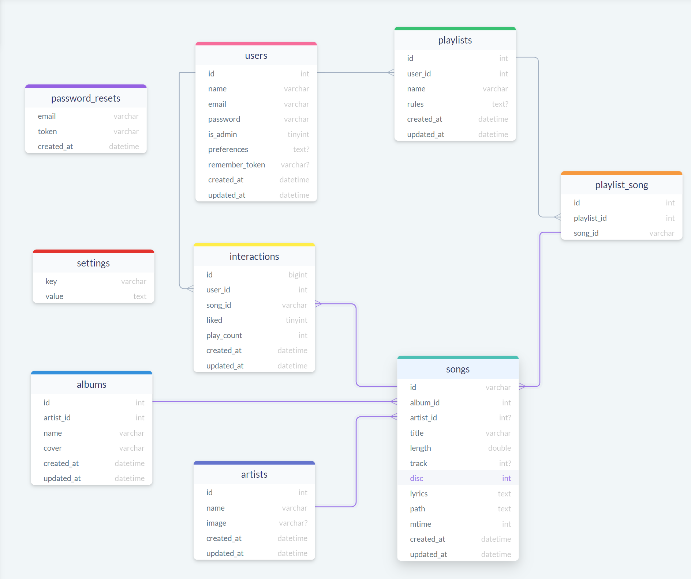
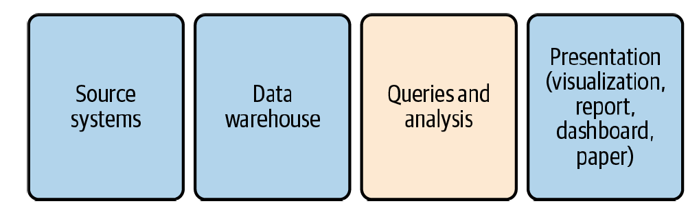

# SQL for Data Analytics

Data analysis blends the power of computing with techniques from traditional statistics. Data analysis is part data discovery, part data interpretation, and part data communication. Very often the purpose of data analysis is to improve decision making, by humans and increasingly by machines through automation.


## What is SQL?

`SQL` is the language used to communicate with databases. The acronym stands for `Structured Query Language` and is pronounced either like “sequel” or by saying each letter, as in “ess cue el.” This is only the first of many controversies and inconsistencies surrounding SQL that we’ll see, but most people will know what you mean regardless of how you say it. 

There is some debate as to whether SQL is or isn’t a programming
language. It isn’t a general purpose language in the way that C or Python
are. SQL without a database and data in tables is just a text file. SQL can’t build a website, but it is powerful for working with data in databases. 

</img>


On a practical level, what matters most is that SQL can help you get the job of data analysis done.  It allows use to interact and capture the relationships between different sources of data. 


SQL is designed for managing data held in a relational database management system (RDBMS), or for stream processing in a relational data stream management system (RDSMS). It is particularly useful in handling structured data, i.e. data incorporating relations among entities and variables.

## SQL vs. Pandas
If you have experience with `pandas` you will notice that there is a big overlap between what you can do with SQL and pandas Read more: 
- [Pandas vs. SQL Cheat Sheet](https://datascientyst.com/pandas-vs-sql-cheat-sheet/)
- [SQL vs Python: Which Should You Learn?](https://www.datacamp.com/blog/sql-vs-python-which-to-learn) 
- [Comparison with SQL (pandas documentation)](https://pandas.pydata.org/pandas-docs/stable/getting_started/comparison/comparison_with_sql.html)

In the broader picture,which one you use depends on your goal, for the most part: 
* SQL is more efficient in querying data but it has less functions whereas in pandas, there might be lag for large volumes of data but it has more functions which enable us to manipulate data in an effective way. 
* SQL works on a relational model which makes linking tables via keys much easier and regulates the entry of data in other tables in case of a foreign key constraint but Pandas makes data manipulation much easier.
* Pandas is better if you intend to manipulate the data or plot it as it does it all in one place whereas in SQL we have to use Tableau for data visualization

However, by knowing both (and when to use them), you can combine the power of both to your advantage.

## Why use SQL?

Perhaps the best reason to use SQL is that much of the world’s data is already in databases. It’s likely your own organization has one or more databases. Even if data is not already in a database, loading it into one can be worthwhile in order to take advantage of the storage and computing advantages, especially when compared to alternatives  such as spreadsheets. 

SQL is the de facto standard for interacting with databases and retrieving data from them. A wide range of popular software connects to databases with SQL, from spreadsheets to BI and visualization tools and coding languages such as Python and R.

When deciding whether to use SQL, R, or Python for an analysis, consider:

* Where is the data located—in a database, a file, a website?
* What is the volume of data?
* Where is the data going—into a report, a visualization, a statistical analysis?
* Will it need to be updated or refreshed with new data? How often?
* What does your team or organization use, and how important is it to conform to existing standards?

</img>

Source: [SQL for Data Analysis by Cathy Tanimura](https://www.amazon.in/SQL-Data-Analysis-Cathy-Tanimura-ebook/dp/B09FX81BDM)

SQL shines in the storage and ETL parts of a data pipeline. SQL is applied to explore, profile, clean, shape, and analyze the data.

In the next few sections, we will dive into how to integrate SQL in our data pipeline. We can use SQL to perform many types of data analyses: timeseries, cohorts, text, anomaly detection, etc. 

What is different now vs. when using Python? Our goal using SQL is mostly to prepare the data for the next step of the process (i.e. exploratory data analysis, modeling, ect.). In this section, we'll walk through one example on how we can leverage SQL for data analysis

# The Data

The SQL examples we will see are based on the book *SQL for Data Analysis by Cathy Tanimura* who has made the datasets from the book avalaible in this Github Repository: https://github.com/cathytanimura/sql_book.

## The Mission: Retail Spending Patterns

Let's say you work for the US Goverment and are interested in knowing consumer spending patterns. You receive a spreadsheet that contains monthly retail sales data (1992 - 2020). The goverment want so create a web report to deploy on their website and store the data in a database assessible to developers around the globe. 
 
It includes both total sales as well as details for subcategories of retail sales. It contains both unadjusted and seasonally adjusted numbers. Sales figures are in millions of US dollars. 


```python
# Import required libraries
import sqlite3
import pandas as pd
  
# Connect to SQLite database
conn = sqlite3.connect(r'./data/us_sales.db')
  
# Load CSV data into Pandas DataFrame
sales_data = pd.read_csv('./data/us_retail_sales.csv')
# Write the data to a sqlite table
sales_data.to_sql('retail_sales', conn, if_exists='replace', index=False)
  
# Create a cursor object
cur = conn.cursor()
```

Let's take a look at the first few rows of our database.


```python
cur.execute("""
            SELECT * 
            FROM retail_sales
            LIMIT 5;
            """)
cur.fetchall()
```


    [('1992-01-01', '441', 'Motor vehicle and parts dealers', None, 29811.0),
     ('1992-01-01', '4411', 'Automobile dealers', None, 25800.0),
     ('1992-01-01',
      '4411, 4412',
      'Automobile and other motor vehicle dealers',
      None,
      26788.0),
     ('1992-01-01', '44111', 'New car dealers', None, 24056.0),
     ('1992-01-01', '44112', 'Used car dealers', None, 1744.0)]


With time series data, we often want to look for trends in the data. A trend is simply the direction in which the data is moving. 

We will query our newly created database and use pandas to plot our results. You can do this in [a few ways](https://datatofish.com/sql-to-pandas-dataframe/), but we will use the `read_sql_query() pandas method`. 


```python
import pandas as pd

query = """SELECT sales_month ,sales
           FROM retail_sales
           WHERE kind_of_business = 'Retail and food services sales, total';
"""
sales_df  = pd.read_sql_query (query, conn)
sales_df.head()
```


<div>
<style scoped>
    .dataframe tbody tr th:only-of-type {
        vertical-align: middle;
    }

    .dataframe tbody tr th {
        vertical-align: top;
    }

    .dataframe thead th {
        text-align: right;
    }
</style>
<table border="1" class="dataframe">
  <thead>
    <tr style="text-align: right;">
      <th></th>
      <th>sales_month</th>
      <th>sales</th>
    </tr>
  </thead>
  <tbody>
    <tr>
      <th>0</th>
      <td>1992-01-01</td>
      <td>146376.0</td>
    </tr>
    <tr>
      <th>1</th>
      <td>1992-02-01</td>
      <td>147079.0</td>
    </tr>
    <tr>
      <th>2</th>
      <td>1992-03-01</td>
      <td>159336.0</td>
    </tr>
    <tr>
      <th>3</th>
      <td>1992-04-01</td>
      <td>163669.0</td>
    </tr>
    <tr>
      <th>4</th>
      <td>1992-05-01</td>
      <td>170068.0</td>
    </tr>
  </tbody>
</table>
</div>


Then we can use our favorite visualization library see our results. I will use plotly which has some nice features for dealing with time series and data axes. Read more: [Time Series and Date Axes in Python](https://plotly.com/python/time-series/#configuring-tick-labels).


```python

import plotly.express as px

fig = px.line(sales_df, x='sales_month', y="sales",
               labels={
                     "sales": "Sales (in millions, USD)",
                     "sales_month": "Month"}, 
              title = "Monthly Retail and Food Services Sales (1992 - 2020)")
fig.show()
```


This data clearly has some patterns, but it also has some noise. Transforming the data and aggregating at the yearly level can help us gain a better understanding. 

- First, we’ll use the `strftime` function to return just the year from the sales_month field and then sum the sales. Read more: [SQL strftime function](https://www.sqlitetutorial.net/sqlite-date-functions/sqlite-strftime-function/)
- The results are filtered to the “Retail and food services sales, total” kind_of_business in the `WHERE` clause:


```python
query = """SELECT strftime('%Y', sales_month) AS sales_year   
,sum(sales) AS sales
FROM retail_sales
WHERE kind_of_business = 'Retail and food services sales, total'
GROUP BY 1 ;"""

yearly_sales_df = pd.read_sql_query (query, conn)
yearly_sales_df.head()
```


<div>
<style scoped>
    .dataframe tbody tr th:only-of-type {
        vertical-align: middle;
    }

    .dataframe tbody tr th {
        vertical-align: top;
    }

    .dataframe thead th {
        text-align: right;
    }
</style>
<table border="1" class="dataframe">
  <thead>
    <tr style="text-align: right;">
      <th></th>
      <th>sales_year</th>
      <th>sales</th>
    </tr>
  </thead>
  <tbody>
    <tr>
      <th>0</th>
      <td>1992</td>
      <td>2014102.0</td>
    </tr>
    <tr>
      <th>1</th>
      <td>1993</td>
      <td>2153095.0</td>
    </tr>
    <tr>
      <th>2</th>
      <td>1994</td>
      <td>2330235.0</td>
    </tr>
    <tr>
      <th>3</th>
      <td>1995</td>
      <td>2450628.0</td>
    </tr>
    <tr>
      <th>4</th>
      <td>1996</td>
      <td>2603794.0</td>
    </tr>
  </tbody>
</table>
</div>


```python
import plotly.express as px
fig = px.line(yearly_sales_df, x='sales_year', y="sales",
               labels={"sales": "Sales (in millions, USD)", "sales_year": "Year"}, 
              title = "Yearly Retail and Food Services Sales (1992 - 2020)")
fig.show()
```


**Exercise: What if we want to compare different categories of service?**

Modify the previous query to compare the yearly sales trend for a few categories that are associated with leisure activities: book stores, sporting goods stores, and hobby stores, and plot the results. 


```python
#Your code here
query = """SELECT strftime('%Y', sales_month) AS sales_year   
,sum(sales) AS sales
FROM retail_sales
WHERE kind_of_business = 'Book stores'
GROUP BY 1 ;"""

yearly_sales_df = pd.read_sql_query (query, conn)
yearly_sales_df.head()

import plotly.express as px
fig = px.line(yearly_sales_df, x='sales_year', y="sales",
               labels={"sales": "Sales (in millions, USD)", "sales_year": "Year"}, 
              title = "Yearly Book Stores (1992 - 2020)")
fig.show()
```


## Analyzing with Seasonality

There are many questions to explore with time series! A common one is to discover patterns in the data. 

**Seasonality** is any pattern that repeats over regular intervals. Unlike other noise in the data, seasonality can be predicted. The word seasonality brings to mind the four seasons of the year—spring, summer, fall, winter—and some data sets include these patterns. 

Shopping patterns change with the seasons, from the clothes and food people buy to the money spent on leisure and travel. The winter holiday shopping season can be make-or-break for many retailers. Let's take a look at out data!

To understand whether seasonality exists in a time series, and at what scale, it’s useful to graph it and then visually inspect for patterns. We can try aggregating at different levels, from hourly to daily, weekly, and monthly. 

You should also incorporate knowledge about the data set. Are there patterns that you can guess based on what you know about the entity or process it represents? 

### Period-over-Period Comparisons: YoY and MoM

Period-over-period comparisons can take multiple forms. The first one is to compare a time period to the previous value in the series, a practice so common in analysis that there are acronyms for the most often-used comparisons. Depending on the level of aggregation the comparison might be year-over-year (YoY), month-over-month (MoM), day-over-day (DoD), and so on.

For these calculations we’ll use the `lag function`, another one of the window functions. The lag function returns a previous or lagging value from a series. 

With an understanding of the values returned by the lag function, we can calculate the percent change from the previous value:


```python
pct_change_query = '''SELECT kind_of_business, sales_month, sales
                    ,(sales / lag(sales) over (partition by kind_of_business 
                                            order by sales_month)
                    - 1) * 100 as pct_growth_from_previous
                    FROM retail_sales
                    WHERE kind_of_business = 'Book stores'
;'''

pct_change_df = pd.read_sql_query (pct_change_query, conn)
pct_change_df.head()
```


<div>
<style scoped>
    .dataframe tbody tr th:only-of-type {
        vertical-align: middle;
    }

    .dataframe tbody tr th {
        vertical-align: top;
    }

    .dataframe thead th {
        text-align: right;
    }
</style>
<table border="1" class="dataframe">
  <thead>
    <tr style="text-align: right;">
      <th></th>
      <th>kind_of_business</th>
      <th>sales_month</th>
      <th>sales</th>
      <th>pct_growth_from_previous</th>
    </tr>
  </thead>
  <tbody>
    <tr>
      <th>0</th>
      <td>Book stores</td>
      <td>1992-01-01</td>
      <td>790.0</td>
      <td>NaN</td>
    </tr>
    <tr>
      <th>1</th>
      <td>Book stores</td>
      <td>1992-02-01</td>
      <td>539.0</td>
      <td>-31.772152</td>
    </tr>
    <tr>
      <th>2</th>
      <td>Book stores</td>
      <td>1992-03-01</td>
      <td>535.0</td>
      <td>-0.742115</td>
    </tr>
    <tr>
      <th>3</th>
      <td>Book stores</td>
      <td>1992-04-01</td>
      <td>523.0</td>
      <td>-2.242991</td>
    </tr>
    <tr>
      <th>4</th>
      <td>Book stores</td>
      <td>1992-05-01</td>
      <td>552.0</td>
      <td>5.544933</td>
    </tr>
  </tbody>
</table>
</div>


Sales dropped 31.8% from January to February, due at least in part to the seasonal decline after the holidays and the return to school for the spring semester. Sales were down only 0.7% from February to March.


```python
import plotly.express as px
fig = px.line(pct_change_df, x='sales_month', y="pct_growth_from_previous",
               labels={
                     "pct_growth_from_previous": "% Growth",
                     "sales_month": "Month"}, 
              title = "Percent growth from previous month for US retail book store sales")
fig.show()
```


How to interpret this plot? For example, we see by computing the percentage growth on a month by month basis that:
* The months of August and December have a higher growth percentage across the years. December being the highest up to 2006 and August the highest from 2006 - 2020. This could be due to the summer and winter season.
* The months of February, September, October, experience the biggest drops in growth percentage. 

This can provide insights on how to plan promotions to encourage sales or adjust the inventory to the demand more accurately. 

**Exercise: The calculation for the YoY comparison is similar, but first we need to aggregate sales to the yearly level.**

Hint:
a. First, create a query that aggregate your data at the yearly level.
b. Modify, the previous query to use the yearly aggregates rather than the monthly data. 


```python
# Your code here

#Your code here
query = """SELECT strftime('%Y', sales_month) AS sales_year   
,sum(sales) AS sales
FROM retail_sales
WHERE kind_of_business = 'Book stores'
GROUP BY 1 ;"""

yearly_sales_df = pd.read_sql_query (query, conn)
yearly_sales_df.head()


pct_change_query = '''SELECT kind_of_business, strftime('%Y', sales_month) AS sales_year, sales
                    ,(sales / lag(sales) over (partition by kind_of_business 
                                            order by sales_month)
                    - 1) * 100 as pct_growth_from_previous
                    FROM retail_sales
                    WHERE kind_of_business = 'Book stores'
;'''

pct_change_df = pd.read_sql_query (pct_change_query, conn)
pct_change_df.head()

import plotly.express as px
fig = px.line(yearly_sales_df, x='sales_year', y="sales",
               labels={"sales": "Sales (in millions, USD)", "sales_year": "Year"}, 
              title = "Yearly Book Stores (1992 - 2020)")
fig.show()
```


```python
# Now, that we are done. Let's close the connection to our database.
conn.close()
```

## Voila! 

You have now combined SQL and pandas to do some exploratory data analysis. There is still a lot to learn. Below are some useful resources.

* [Learning SQL? 12 Ways to Practice SQL Online](https://learnsql.com/blog/ways-to-practice-sql-online/)
* [SQL with PowerBI Tutorial](https://www.datacamp.com/tutorial/sql-with-powerbi)
* [Beginner’s Guide For Data Analysis Using SQL](https://www.analyticsvidhya.com/blog/2021/07/beginners-guide-for-data-analysis-using-sql/)
* [SQL Interview Questions: A Data Analyst's Guide for Success](https://www.coursera.org/articles/sql-interview-questions)
